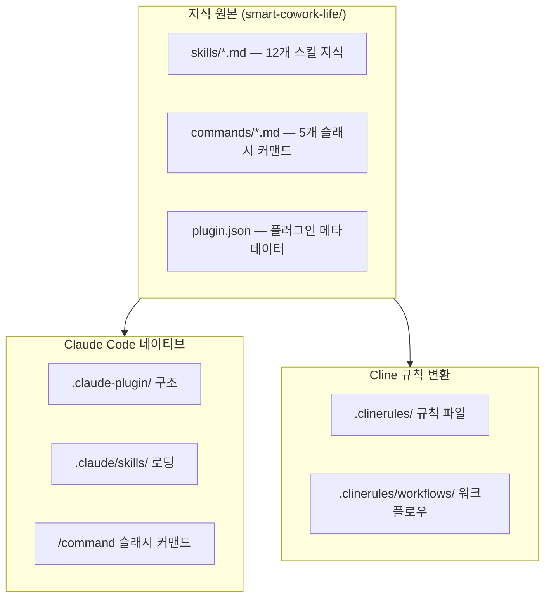

# Smart Cowork Life — 아키텍처 개요

생성일: 2026-02-26
버전: plugin v1.3.0

---

## 1. 프로젝트 정체성

**Smart Cowork Life**는 한국 직장인·취준생을 위한 AI 업무 자동화 플러그인입니다. Claude Code의 네이티브 플러그인 형식으로 배포되며, 이메일·보고서·회의록·제안서·엑셀·PPT·번역 등 업무 전반을 12개 스킬과 5개 슬래시 커맨드로 커버합니다.

저작자: Modu-AI (https://mo.ai.kr)
라이선스: MIT

---

## 2. 이중 배포 구조 (Dual-Format Architecture)

이 플러그인은 동일한 지식 기반을 두 가지 플랫폼 형식으로 동시 제공합니다.



| 항목 | Claude Code 네이티브 | Cline 변환 |
|------|---------------------|-----------|
| 스킬 위치 | `.claude-plugin/` + `skills/` | `.clinerules/` |
| 트리거 방식 | MANDATORY TRIGGERS 키워드 자동 감지 | rules 파일 매칭 |
| 커맨드 | `/daily-report` 등 슬래시 커맨드 | 워크플로우 파일 |
| 설정 파일 | `plugin.json` | `.clinerules` 루트 파일 |

---

## 3. 핵심 설계 패턴

### 3.1 Progressive Disclosure (점진적 공개)

각 스킬은 YAML frontmatter의 `description`(~200자, 항상 로드)과 SKILL.md 본문(실제 지식, 트리거 시 로드)으로 분리됩니다.

```
스킬 로딩 흐름:
  1. Claude 시작 시 → description만 로드 (~100 토큰/스킬)
  2. 사용자 발화 키워드 감지 → SKILL.md 본문 전체 로드
  3. 출력 생성 → 스킬 지식 활용
```

이를 통해 12개 스킬이 동시에 존재해도 초기 컨텍스트 부담이 최소화됩니다.

### 3.2 Two-Tier 지식 구조

```
Tier 1 — 자동화 지식 (SKILL.md 내장)
  - 문서 양식 및 템플릿
  - 격식 수준 가이드
  - 수식 패턴 (엑셀, 4대보험 요율)
  - 디자인 상수 (색상 팔레트, 폰트 규칙)

Tier 2 — 실행 로직 (커맨드 파일 내장)
  - 입력 파싱 규칙
  - 출력 형식 선택 (docx/xlsx/md/txt)
  - 워크플로우 단계 정의
```

### 3.3 한국 비즈니스 특화 설계

모든 스킬은 한국 직장 문화를 전제로 설계되었습니다.

- **격식체 우선**: "~합니다", "~입니다" 체계 기본 적용
- **기-승-전-결 구조**: 보고서·기안서 등 문서 구조
- **결재선 포맷**: 한국 기업의 담당→팀장→부장→이사 결재 라인
- **수치 표기법**: 억원·만원 단위, ▲/▼ 증감 표기, 한국식 날짜
- **2026년 법규 반영**: 4대보험 요율 최신화

---

## 4. 시스템 경계

### 범위 내 (In-Scope)

- 12개 업무 스킬 지식 제공
- 5개 슬래시 커맨드 실행
- 텍스트·마크다운 형식 출력
- 코드 생성 (PptxGenJS, SVG, Python 분석 코드)
- 번역 및 문체 변환

### 범위 외 (Out-of-Scope)

- 실제 파일 저장 (`.docx`, `.xlsx`, `.pptx` 직접 생성)
  - 코드를 생성하고 사용자가 실행하는 방식
- 외부 API 호출 (번역 API, 회계 API 등)
- 실시간 데이터 조회 (주식, 환율, 법령 변경 등)
- 사용자 데이터 저장 및 세션 간 기억

---

## 5. 플랫폼별 배포 모델

### Claude Code 배포 모델

```
사용자 Claude Code 환경
└── .claude-plugin/
    ├── plugin.json  (메타데이터, 마켓플레이스 등록 정보)
    └── smart-cowork-life.plugin  (플러그인 번들)
        ├── skills/  (12개 SKILL.md)
        └── commands/  (5개 커맨드 파일)
```

마켓플레이스 설치 경로: Claude Code 마켓플레이스 → 플러그인 검색 → 설치

### Cline 배포 모델

```
프로젝트 루트
└── .clinerules/
    ├── (스킬 규칙 파일들)
    └── workflows/
        └── (워크플로우 파일들)
```

---

## 6. 핵심 아키텍처 결정 사항

| 결정 | 이유 |
|------|------|
| 스킬당 단일 SKILL.md 구조 | Progressive Disclosure 구현, 토큰 효율 극대화 |
| MANDATORY TRIGGERS 패턴 | 사용자가 명시적 명령 없이 자연어로 스킬 활성화 가능 |
| 코드 생성 방식 출력 | 실제 파일 생성은 사용자 환경에 의존, 코드 제공으로 호환성 확보 |
| Pretendard 폰트 번들 내장 | 한국어 폰트 의존성 자체 해결, 배포 환경 독립성 |
| 2026년 데이터 하드코딩 | 4대보험 요율 등 자주 변경되는 법규 데이터의 최신성 보장 |
| 한영 이중 지원 | 한국 직장인의 실제 업무 환경(한국어+영어 혼용) 반영 |
